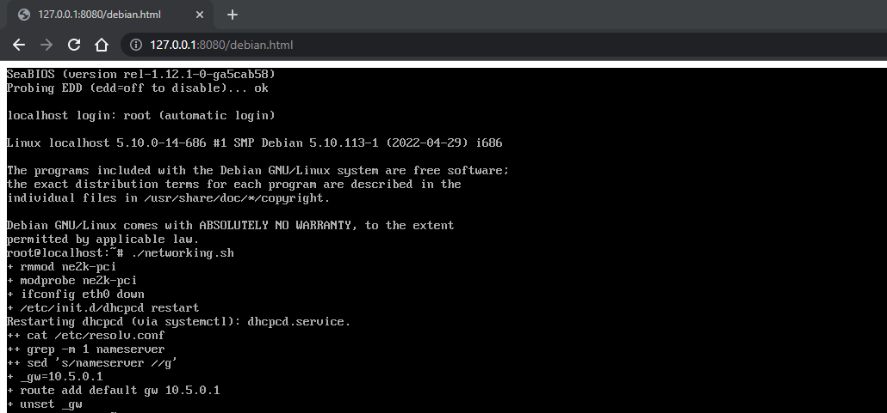
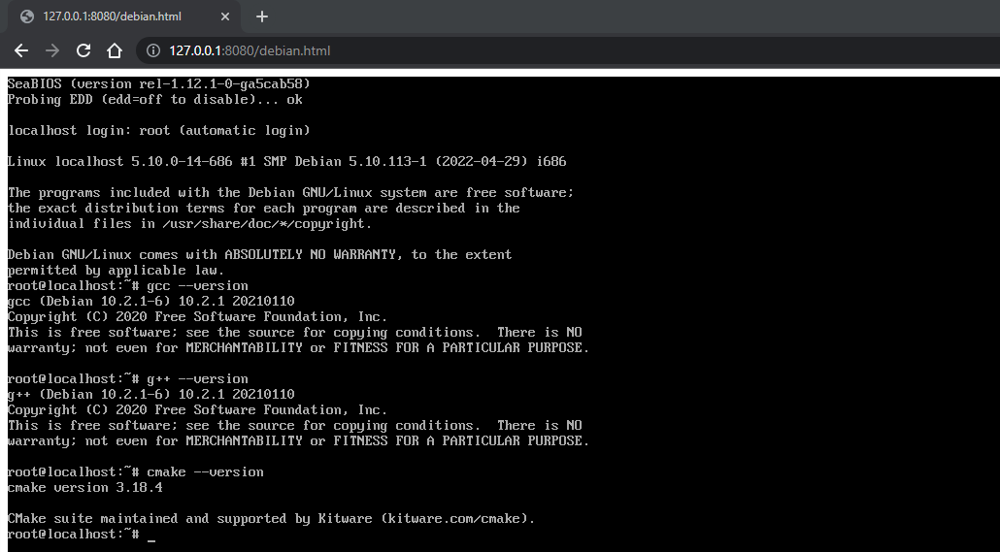
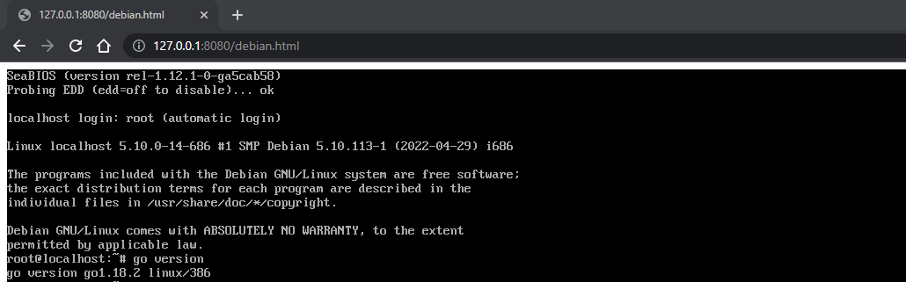
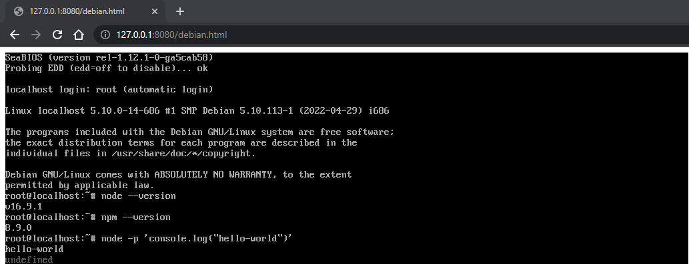
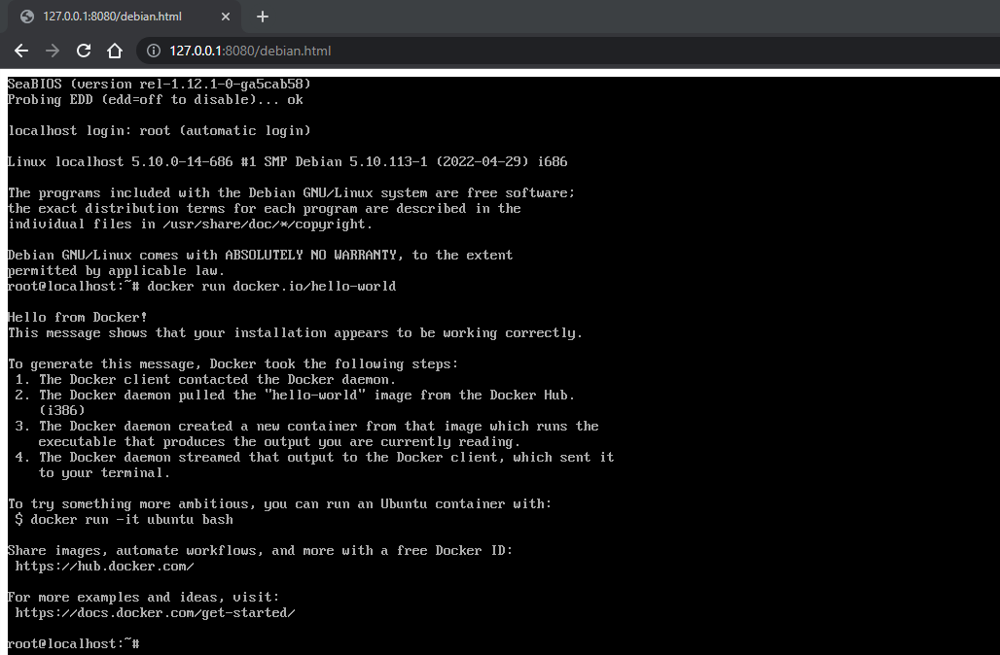
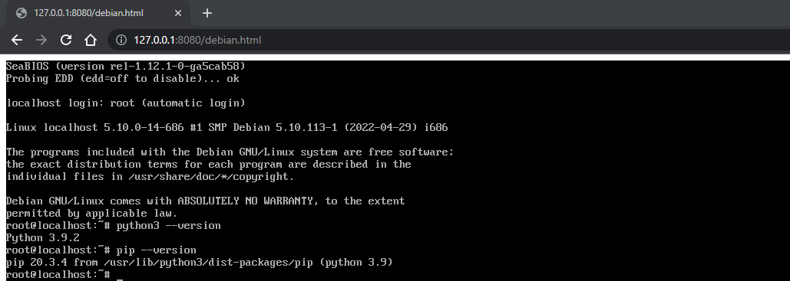
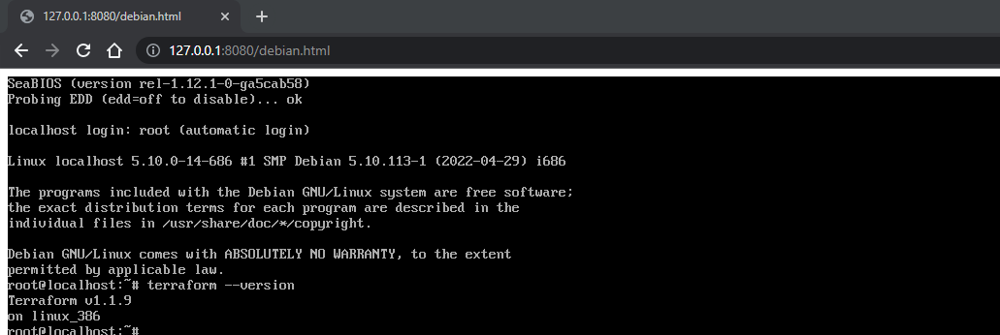
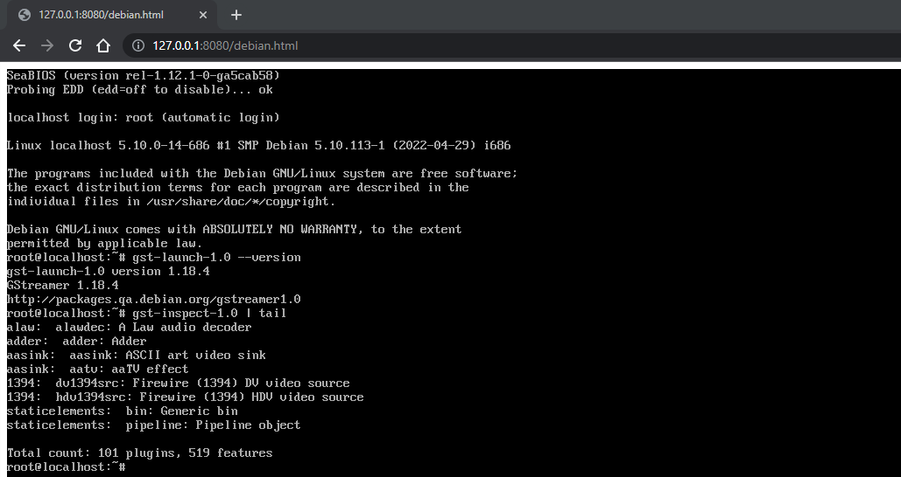

# bent container images

a collection of images to be used as OS disks in [v86](https://github.com/copy/v86/) and booted entirely in browser.

currently image sizes are:

```bash
$ docker images --format "{{.Tag}}: {{.Size}}" --filter=reference='bent*'
debian: 361MB
generic: 702MB
golang: 669MB
nodejs: 460MB
podman: 467MB
python: 401MB
terraform: 424MB
gstreamer: 504MB
```

## gallery

### debian



### generic



### golang



### nodejs



### podman



### python



### terraform



### gstreamer



## build images

you need Docker installed globally for these to work.

```bash
npm run debian
npm run generic
npm run podman
npm run nodejs
npm run python
npm run golang
npm run terraform
npm run gstreamer
```

## run images

```bash
npm run demo
```
