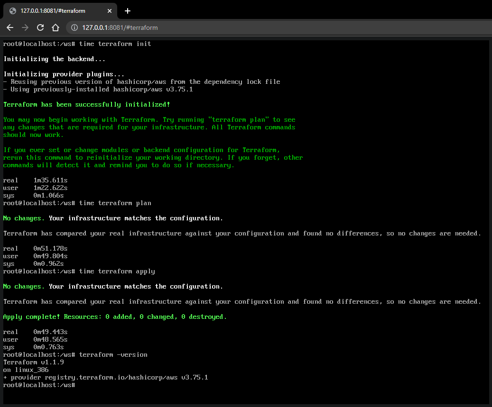

# bent container images

a collection of images to be used as OS images in [v86](https://github.com/copy/v86/) and booted entirely in browser.

## gallery

### debian

### generic

### golang

### nodejs

### podman

### python

### terraform

